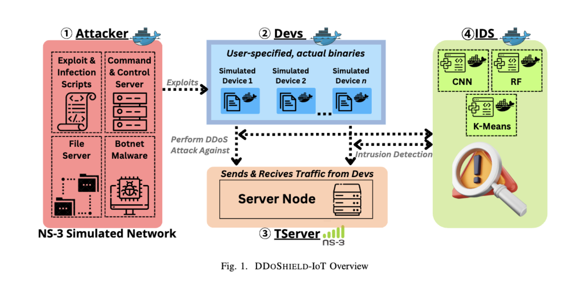

# DDoShield-IoT: Testbed for Evaluating IDS Performance against Botnet Distributed Denial of Service Attacks in IoT Environments


DDoShield-IoT is an open-source project developed to simulate a testbed IDS performance evaluation against Botnet Distributed Denial of Service attacks in IoT environments for academic research purposes. The project offers a versatile and expandable platform that empowers researchers and network security professionals to scrutinize the behavior, consequences, and mitigation strategies of DDoS attacks in a controlled setting. DDoShield-IoT achieves these objectives by incorporating a diverse array of realistic nodes, representing various components, all seamlessly integrated within a simulated network environment.
<br/>

## Components

The framework consists of four main components:

1. **Attacker**: A Docker node representing the attacker, loaded with tools and scripts for remotely exploiting and controlling Devs.
2. **Devs**: A variable number of Docker nodes representing target devices, loaded with actual vulnerable IoT binaries.
3. **TServer**: A customized NS-3 node representing the target of the botnet DDoS attack.
4. **IDS**: A Docker node representing a Real-Time IDS Unit that leverages ML models for
botnet DDoS attack detection.
<br/>
<p align="center">

</p>
<br/>


## Features

- Simulates various DDoS attack scenarios
- Customizable attack patterns and intensities
- Extensible architecture for adding new attack vectors
- Investigate the impact of network conditions, attack size, and duration on target servers
- Intrusion detection with various ML models in real time
- And more...
<br/>


## **Getting Started**


### Installation:

> **Note**: The steps are verified on Ubuntu 22.04 LTS and Debian 12. The current version of DDoSim uses NS3 version 3.38 and Docker version 20.10.

1. Install Git:

  ```bash
  sudo apt-get install -y git
  ```

2. tc is a part of the iproute2 package (usually installed by default on most Linux distributions)
```bash
sudo apt-get update
sudo apt-get install iproute2
```

3. Clone the DDoShield-IoT repository:

  ```bash
  git clone https://github.com/iobaidat/DDoShield-IoT.git
  ```

4. Change the permissions of the files in the downloaded directory:

  ```bash
  chmod +x -R DDoShield-IoT/
  ```

5. Navigate to the downloaded directory:

  ```bash
  cd DDoShield-IoT/
  ```

6. Run the [./install.sh](install.sh) script to install DDoShield-IoT's dependencies:
 > **Note**: Do not use ```sudo``` with this command, ```sudo``` is placed wherever it is needed in this script.

  ```bash
  ./install.sh
  ```

7. After successful installation, reboot the system
<br/>

## **Usage**


### Nodes creation (Attacker, Devs and TServer):

> **Note**: </br>
> &nbsp; &nbsp; &nbsp; &nbsp;&nbsp;  - The framework uses a python script ```main.py``` to perform all of the main operations </br>
> &nbsp; &nbsp; &nbsp; &nbsp;&nbsp;  - Initial framework setup may take longer due to the time-consuming process of building Docker nodes</br>
> &nbsp; &nbsp; &nbsp; &nbsp;&nbsp;  - To check all available options run: ``` ./main.py --help ``` </br>

1. Navigate to the downloaded directory after the reboot:

  ```bash
  cd DDoShield-IoT/
  ```
2. To Create a specfic number of nodes, use the following command:

    ```bash
    ./main.py -d <nodes> create
    ```
    e.g.,:
    ```bash
    ./main.py -d 3 create
    ```

3. To connect the nodes to the NS3 network simulator, use the following command:

    ```bash
    ./main.py -d <nodes> ns3
    ```
    e.g.,:
    ```bash
    ./main.py -d 3 ns3
    ```

    This will create the the desired number of Docker containers, bridges and tap interfaces, and will configure the simulator. Then it will start the NS3 process.

### IDS execution:
1. Open a new terminal and access IDS's Docker terminal:

  ```bash
  docker exec -it emu3 bash
  ```
2. Run the [./ids-online.py](ids-online.py) script to start the real-time intrusion detection process:

  ```bash
  ./ids-online.py
  ```
- You should see the detection. Otherwise, run the ns3 command again.

### To Attack:

1. Open a new terminal and access Attacker's Docker terminal to connect the _Command & Control Server_ (C&C). The C&C Server is used to control the bots. To access the C&C Server, use the following command:

    ```bash
    docker exec -it emu2 bash
    ```
    Then connect to the C&C Server:
    ```bash
    telnet localhost
    ```
    For this command, use the following credentials:

    Username: ```root```</br>
    Password:&nbsp; ```root```

    > **Note**: See supported attacks: [attack-instructions](attack-instructions.md)

2. To launch an attack, make sure that Devs are connected to the C&C Server. You can see the number of bots in the title bar of the terminal running the C&C Server. Type the attack command in the C&C server's terminal, e.g.,:

    ```bash
    udp 10.0.0.1 2 dport=9
    syn 10.0.0.1 2 dport=9
    ack 10.0.0.1 2 dport=9
    ```

    > **Note**: The IP address "10.0.0.1" is the IP of TServer. This IP is the same across all runs. You can also see this IP in the same terminal that you run the ```./main.py -d <nodes> ns3``` command.

### Destroy nodes and reclaim used resources:

1. The created nodes should be destroyed to create a different number of new nodes. To do so use the following command:

    ```bash
    ./main.py -d <nodes> destroy
    ```
    e.g.,:

    ```bash
    ./main.py -d 3 destroy
    ```


## Citing DDOShiedl-IoT

If you use DDoShield-IoT in your research, please consider citing our paper to acknowledge the work we've put into the project. You can find our paper at the following link:

[DDOSHIELD-IoT: A Testbed for Simulating and Lightweight Detection of IoT Botnet DDoS Attacks]()

Here is a citation in BibTeX format for your convenience:

   ```
   @inproceedings{
    }
   ```


## Contributing

We warmly welcome contributions to the DDoSim project. If you're interested in getting involved, please feel free to submit issues, feature requests, or pull requests on our GitHub repository. We value the expertise and insights of our community members and look forward anticipate collaborating with you to enhance and expand DDoSim's capabilities.


### Code Organization
The DDoSim source code is organized into files and directories as follows:
- `install.sh`: This is a bash script responsible for installing the necessary dependencies for DDoSim.
- `main.py`: This is our primary file, tasked with creating, managing, and terminating DDoSim's simulations.
- `docker`: This directory houses the Docker container files (Dockerfile), which are tasked with loading the Attacker, IDS, and Dev nodes with their necessary binaries.
- `connections`: This directory contains scripts that maintain the connections of the various Docker nodes within the NS3 network.
- `network`: This directory includes the NS3 simulator code base as well as our network setup codes.


## Acknowledgements
We would like to extend our gratitude to the [NS3DockerEmulator](https://github.com/chepeftw/NS3DockerEmulator/) project for providing the foundational framework upon which DDOSim was built. This crucial resource enabled us to create a powerful and versatile simulation tool for studying DDoS attacks.


## Contact

For any questions or suggestions, please contact the project maintainers:
 * Islam Obaidat: <a href="mailto:iobaidat@charlotte.edu">iobaidat@charlotte.edu</a>
 * Simona De Vivo <a href="mailto:simona.devivo@unina.it">simona.devivo@unina.it</a>
