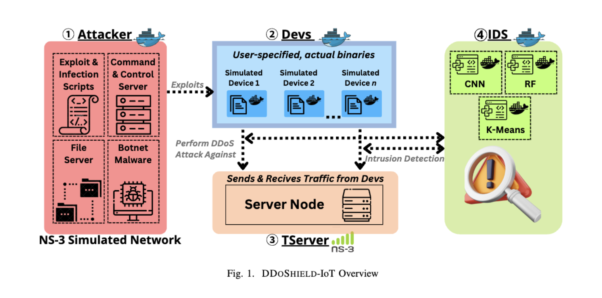

# DDoShield-IoT
**Testbed for Evaluating IDS Performance against Botnet Distributed Denial of Service Attacks in IoT Environments**

DDoShield-IoT is an open-source testbed to **simulate IoT botnet DDoS traffic**, **run ML-based IDS in real time**, and **evaluate detection quality** in a controlled, reproducible environment. It orchestrates Docker containers (Attacker, Devs, IDS, Target Server) and connects them over an **ns-3** emulated network so you can vary topology, delay, loss, bottlenecks, and bandwidth.

<p align="center">

</p>

---

## Requirements
- OS: **Ubuntu 22.04/24.04** or **Debian 12**
- Hardware: ≥ **4 CPU cores**, **8 GB RAM** (16 GB+ recommended), **25 GB** free disk
- Python: **3.8 or newer** (tested with **3.8–3.12**)
- Internet access during install
- Sudo privileges (installer will prompt where needed)

### Sudo and privileges

Both `install.sh` and `ddosim` may ask for your sudo password to:

- install packages
- load kernel modules (`modprobe`)
- configure tap/bridge interfaces

This is expected. If you’re on a shared system, make sure you’re allowed to use `sudo` before running the installer.

> **Note:** DDoShield-IoT is designed for Linux hosts (Ubuntu/Debian).  
> It relies on `ip netns`, tap interfaces, and kernel modules that are not available on Windows or macOS without heavy virtualization.

---

## Download & Install
The following downloads DDoShield-IoT and sets up Docker, Docker Buildx, and ns‑3 (version pinned in `network/ns3_version`).

```bash
# 1) Install git.
sudo apt-get install -y git

# 2) Clone the DDoShield-IoT repository.
cd ~ && git clone https://github.com/iobaidat/DDoShield-IoT.git

# 3) Change the permissions of the files in the downloaded repository (add execute permissions to files in DDoShield-IoT).
sudo chmod +x -R DDoShield-IoT/

# 4) Navigate to the downloaded repository.
cd ~/DDoShield-IoT

# 5) Install dependencies (show progress). Do NOT prefix with sudo.
./install.sh -v
```

> **Important:** After `./install.sh` completes, **reboot the machine** before running `ddosim`. Docker non‑root access is not active until after a reboot.

### Notable installer options
- `--ns3-only` / `--docker-only` – install only one side
- `--ns3-profile {optimized|debug}` – choose ns‑3 build profile (default: `optimized`)
- `--ns3-configure-only` – ensure the exact version in `network/ns3_version` is present, then (optionally) clean, reconfigure, and rebuild
- `--ns3-clean {auto|none|clean|distclean}` – cleaning strategy before configure (default: `auto`)

Examples:
```bash
# Reconfigure/rebuild only, no Docker steps (optimized)
./install.sh --ns3-configure-only --ns3-profile optimized

# Reconfigure/rebuild with full clean (debug)
./install.sh --ns3-configure-only --ns3-clean distclean --ns3-profile debug
```

### How ns-3 version is selected

The `install.sh` script manages the ns-3 version for you and records it in `network/ns3_version`.
`ddosim` then reads this file to know which ns-3 tree to use.

Behavior:

- **If you do nothing**:
  - `./install.sh` automatically detects the latest stable ns-3 release from the official
    ns-3 repositories and installs it.
  - The selected version is written to:
    `network/ns3_version`
- **If you want a specific version**:
  - Run:
    ```bash
    ./install.sh --ns3-version X.YY
    ```
    (for example: `./install.sh --ns3-version 3.43`)
  - The script validates that the corresponding tarball exists and only then updates
    `network/ns3_version`.

Layout handling (automatic):

- For **ns-3 < 3.45**:
  - Uses `ns-allinone-X.YY` layout:
    `network/ns-allinone-X.YY/ns-X.YY`
- For **ns-3 ≥ 3.45**:
  - Uses the core-only layout:
    `network/ns-X.YY/`

At runtime:

- `ddosim` checks:
  - that `network/ns3_version` exists,
  - that the matching ns-3 directory exists,
  - and that the `ns3` launcher is present.
- If anything is missing or inconsistent, it will instruct you to re-run:
  ```bash
  ./install.sh [--ns3-version X.YY]
  ```

---

## Usage: Full Workflow

### 1) Navigate to DDoShield-IoT repository

```bash
cd ~/DDoShield-IoT
```

### 2) CLI help

```bash
ddosim --help
```

#### Verbosity hints

- `-v quiet`  (default) – minimal console noise, good once everything works.
- `-v info`   – light progress messages.
- `-v verbose` – includes child process output (Docker / ns-3).
- `-v debug`  – maximum detail; recommended for the **first** `create` on a new machine.


### 3) Create nodes
To Create a specific number of Devs (i.e., IoT Devices), use the following command:

```bash
ddosim -d <N> -v debug create
# examples: create 3 devices
ddosim -d 3 -v debug create
```

#### Choose Dev traffic app (`-a`)

By default, Devs choose **one** app at container start and **stick to it** for the whole run. You can force a specific app for **all** Devs or keep the default randomized behavior.

**Behavior**

* `-a all` (default): each Dev randomly selects one of `{ffmpeg, http, ftp}` at first start and uses it for the entire run.
* `-a ffmpeg`: all Devs use RTMP push to **10.0.0.1:1935**.
* `-a http`: all Devs repeatedly GET files from **10.0.0.1:80**.
* `-a ftp`: all Devs repeatedly fetch files via FTP from **10.0.0.1:21**.

**Examples**

```bash
# Random per-Dev (default)
ddosim -d 3 -v debug create

# Force HTTP for all Devs
ddosim -d 3 -a http -v debug create

# Force RTMP for all Devs
ddosim -d 3 -a ffmpeg -v debug create
```

**Notes**

* On the **host**, put your media files (e.g., `.mp4`) under `docker/videos/` in the repo.
* Dev containers see this directory mounted read-only at `/data` inside the container.
* The per-Dev app choice persists for the container lifetime. To reshuffle: run `destroy`
  and `create` again (or remove `/var/run/selected_app` inside a Dev).


> **Note — First Run Takes Longer**
> The very first `ddosim -d <N> create` (optionally with `-v debug`) can take a while
> because Docker builds all node images (Attacker, Devs, TServer, IDS) and pulls base
> layers. Subsequent runs are **much faster** thanks to Docker layer caching.
>
> Tips:
> - Use `-v debug` once to see build progress (e.g., `ddosim -d 2 -v debug create`).
>   After the first run you can omit `-v debug` (default output is concise).
> - Check disk usage with `docker system df`.
> - To reclaim space later: `docker system prune -a` (removes **unused** images, **stopped**
>   containers, unused networks, and build cache). After pruning, the next
>   `ddosim -d <N> create` will rebuild images again from scratch and take longer.

### 4) Start the ns-3 network

```bash
ddosim -d <N> -v debug ns3
# examples:
ddosim -d 3 -v debug ns3
```

This creates bridges/taps, attaches containers, configures the simulator, and starts emulation. The target server (TServer) is reachable at **10.0.0.1** by default.

### 5) Run the IDS (real time)

Open a **new terminal** (second terminal) and attach to the IDS container (named `emu3`):

```bash
docker exec -it emu3 bash
```

Start the online IDS with:

```bash
/home/ids-online-predict.py --bundle /home/ids-model-bundle --duration 180
```

* `--bundle` → path to the deployed model bundle
* `--duration` *(optional)* → total run time in seconds; **if omitted, the IDS runs continuously until you stop it (Ctrl+C)**.

Once you start the IDS, you should see the IDS traffic classification output.

> **Model training pipeline** is in the repo at:
>
> `DDoShield-IoT/docker/IDS/model_train_pipeline`

### 6) Launch attacks from the C&C (Attacker)

Open **another terminal** (third terminal) and attach to the Attacker container (named `emu2`):

```bash
docker exec -it emu2 bash
```

Then open the C&C console:
```bash
telnet localhost
# Credentials:
#   user: root
#   pass: root
```

To launch an attack, make sure that Devs are connected to the C&C Server.

**Check that bots (Devs) are connected**

* Type `botcount` in the C&C console to show how many bots are currently connected.
* The terminal title bar will also display the number of connected bots.

Type the attack command in the C&C console. Example attack commands:

```text
udp 10.0.0.1 2 dport=9
syn 10.0.0.1 2 dport=9
ack 10.0.0.1 2 dport=9
```

**What those fields mean**

* `udp` / `syn` / `ack` → the attack type
* `10.0.0.1` → target IP (TServer)
* `2` → attack duration (seconds)
* `dport=9` → destination port to target on the TServer

**Attacks**
General form:

```
<attack> <target-ip> <duration-seconds> [options]
```

**See available attacks**

* Type `?` in the C&C console to list all supported attack commands.

* Check [attack-instructions](attack-instructions.md) to list all supported attack commands and their options

**Tips**

* You can queue multiple attacks back-to-back by entering several lines in the C&C console.
* To exit the C&C: type `quit` or `exit`.
* If no bots show up in `botcount`, make sure the Dev containers were created and attached to the ns-3 network (`ddosim -d <N> create` then `ddosim -d <N> ns3`).


### 7) Destroy nodes (cleanup)

```bash
ddosim -d <N> -v debug destroy
# example:
ddosim -d 3 -v debug destroy
```

---

## Examples

### Create 5 devices, start network, run IDS

```bash
# In the first terminal, run:
ddosim -d 5 create
ddosim -d 5 ns3

# Open a second terminal, run:
docker exec -it emu3 bash
/home/ids-online-predict.py --bundle /home/ids-model-bundle --duration 180
```

### Three short attacks back-to-back

```bash
# Open a third terminal, run:
docker exec -it emu2 bash
telnet localhost
# then run (below are three different attacks):
udp 10.0.0.1 2 dport=9
syn 10.0.0.1 2 dport=9
ack 10.0.0.1 2 dport=9
```

### Recreate with a different device count

```bash
ddosim -d 5 destroy
ddosim -d 12 create
ddosim -d 12 ns3
```

### Destroy and reclaim resources

```bash
ddosim -d 12 destroy
```

---

### Capturing PCAPs (Wireshark or tcpdump)
You can capture traffic from any node in the testbed for analysis. Install tools on the **host**:
```bash
sudo apt-get install -y wireshark tcpdump
```

**Node naming cheat-sheet**
- `emu1` = TServer (target)
- `emu2` = Attacker (C&C)
- `emu3` = IDS
- `emu4` and above = IoT devices (e.g., with `-d 2`, devices are `emu4`, `emu5`)

#### Option A — Wireshark (GUI)
1) Open **Wireshark** on the host.
2) Select the interface named **`si-emuN`** for the node you want to monitor  
   (e.g., **`si-emu3`** to monitor all packets delivered to the IDS).
3) Click **Start**. When done, **File → Save As…** to export a **.pcap**.

#### Option B — tcpdump (CLI, host-side)
Use this one-liner to capture on the **host interface** that corresponds to a container’s `eth0`.
It writes a timestamped **.pcap** in the current directory.

```bash
# Example: capture for the IDS (emu3)
cid=emu3; sudo tcpdump -i "$(ip -o link | awk -F': ' -v idx=$(docker exec "$cid" cat /sys/class/net/eth0/iflink) '$1==idx {split($2,a,"@"); print a[1]}')" -s0 -w "${cid}_$(date +%s).pcap"
```

- Similar to Wireshark, to capture the **Attacker** use `cid=emu2`, for the **TServer** use `cid=emu1`, etc.
- Press **Ctrl+C** to stop. The PCAP is saved in your current directory.

**Tips**
- Limit duration or rotate files to avoid large captures:
  ```bash
  # 60-second chunks, keep 5 files max (rotating), full packets, no DNS lookups
  cid=emu3; sudo tcpdump -i "$(ip -o link | awk -F': ' -v idx=$(docker exec "$cid" cat /sys/class/net/eth0/iflink) '$1==idx {split($2,a,"@"); print a[1]}')" -s0 -n -G 60 -W 5 -w "${cid}_$(date +%s).pcap"
  ```
- Verify a capture: open in Wireshark or run `capinfos <file.pcap`.
- If your distro restricts GUI capture without root, add your user to the `wireshark` group and re-log, or run Wireshark/tcpdump with `sudo`.

---

## Configuration (`config.yaml` / `config.conf` / `DDOSIM_CONFIG`)

You can customize defaults (number of Devs, image names, logging, etc.) with a config file. By default, `ddosim` looks for **`config.yaml`** in the repository root. You can also point to **any** file (YAML or JSON) using the `DDOSIM_CONFIG` environment variable.

### Where to put it

* **Default**: `./config.yaml` (project root)
* **Custom location / filename**: set `DDOSIM_CONFIG=/path/to/your-config.conf` before running `ddosim`.

Examples:

```bash
# One-off run with a custom config path (YAML or JSON content)
DDOSIM_CONFIG=/path/to/config.conf ddosim -v info create

# Make it permanent in your shell session
export DDOSIM_CONFIG=$PWD/my-config.yaml
ddosim ns3
```

> Note: The loader accepts YAML **or** JSON regardless of file extension. A `config.conf` that contains YAML is fine.

### Precedence (who wins)

1. **CLI flags** (e.g., `-d`, `-a`, `-v`)
2. **Env var** `DDOSIM_CONFIG` (points to a file to load)
3. **`config.yaml`** in the repo root
4. Built-in defaults

### Minimal example (`config.yaml`)

```yaml
# config.yaml
num_devs: 4
emulation_time_sec: 600
network_type: csma      # csma | wifi
churn_mode: "0"         # "0"=none, "1"=static, "2"=dynamic
ns3_file_log_mode: "0"  # "0"=off, "1"=pcap only, "2"=pcap+stats

dev_app: all            # all | ffmpeg | http | ftp

images:
  tserver: tserver
  attacker: myattackbox
  ids: ids
  dev: mydnsmasqbox

paths:
  results_subdir: results
  pids_dir: ./var/pid

project_label: ddosim
container_basename: emu
destroy_scope: project   # project | run | all
build_jobs: 7            # parallel build jobs for ns-3 (tune per host)
```

### Full option reference

* `num_devs` *(int)*: Number of IoT Dev containers to create.
* `emulation_time_sec` *(int)*: ns-3 simulation duration.
* `network_type` *(str)*: `csma` or `wifi` (selects the scenario file).
* `churn_mode` *(str)*: `"0"` = no churn, `"1"` = static churn, `"2"` = dynamic.
* `ns3_file_log_mode` *(str)*: `"0"` = off, `"1"` = pcap only, `"2"` = pcap + stats.
* `scenario_size_meters` *(str/int)*: Only for `wifi`; scene size in meters.
* `build_jobs` *(int)*: Parallel jobs when building ns-3 (`./ns3 build -j N`).
* `dev_app` *(str)*: Traffic generator used by Devs:

  * `all`: each Dev randomly picks **one** app at first start and persists it
  * `ffmpeg`: all Devs stream via RTMP to `10.0.0.1:1935`
  * `http`: all Devs fetch via HTTP from `10.0.0.1:80`
  * `ftp`: all Devs fetch via FTP from `10.0.0.1:21`
* `images` *(map)*: Docker image tags for each role (`tserver`, `attacker`, `ids`, `dev`).
* `paths.results_subdir` *(str)*: Directory under the repo where logs/results go.
* `paths.pids_dir` *(str)*: PID files for container/process bookkeeping.
* `project_label` *(str)*: Shared Docker label to group containers (used by `destroy`).
* `container_basename` *(str)*: Prefix for container names (e.g., `emu1`, `emu2`, …).
* `destroy_scope` *(str)*: `project` (default), `run`, or `all`.

### Overriding via CLI

Any config value that also has a CLI flag can be overridden per run. Common examples:

```bash
# Use config values except the ones you override here:
ddosim -d 4 -a http -v debug create
ddosim -t 900 ns3
ddosim --destroy-scope all destroy
```

### Verifying what loaded

Run with `-v info` or `-v debug`. The header shows active settings (including “Dev App Policy” and the selected ns-3 version). If your custom file didn't load, ensure `DDOSIM_CONFIG` points to a readable path.

---

## Tips & Troubleshooting

* **"ddosim requires Python 3.8 or newer"** → Your system's `python3` is too old.
  Install Python 3.8+ (e.g., Ubuntu 20.04+ / Debian 11+) or use a newer Python from
  `pyenv` / `conda`.

* **“permission denied” on docker** → Reboot after install so your user is in the `docker` group.
* **First `create` is slow** → Images are being built and cached; later runs are faster.
* **“Error creating container side bridges”** → Re-run `ddosim -d <N> ns3` after `create`; ensure interfaces exist before continuing.
* **No IDS output** → Ensure traffic is flowing (make sure ns3 is running: `ddosim -d <N> ns3`) and that IDS is running with the command above.
* **Logs / artifacts**

  * Run logs: `results/logs/<run_id>/`  
    From your home directory this is typically `~/DDoShield-IoT/results/logs/<run_id>/`.  
    `ddosim` prints the exact run log path each time you invoke it.
  * Reclaim disk: `docker system prune -a` (careful: removes unused images, stopped
    containers, unused networks, and build cache).


---

## Citing DDoShield-IoT

If you use DDoShield-IoT in your research, please cite:

[DDoShield-IoT: A Testbed for Simulating and Lightweight Detection of IoT Botnet DDoS Attacks](devivo2024ddoshieldiot.pdf)

```bibtex
@inproceedings{devivo2024ddoshieldiot,
  title={{DDoShield-IoT}: A Testbed for Simulating and Lightweight Detection of {IoT} Botnet {DDoS} Attacks},
  author={Simona De Vivo and Islam Obaidat and Dong Dai and Pietro Liguori},
  booktitle={54th Annual IEEE/IFIP International Conference on Dependable Systems and Networks Workshops (DSN-W)},
  pages={1--8},
  year={2024}
}
```

---

## Known issue: Wi-Fi + TapBridge on newer ns-3 (CSMA unaffected)

By default, DDoShield-IoT uses **CSMA**, which works fine on current ns-3 releases (no action needed).

If you explicitly select **Wi-Fi** (`-n wifi`), be aware of an upstream regression affecting **TapBridge + Wi-Fi** on newer ns-3 (assert around `linkId.has_value()`); see the ns-3 issue tracker. ([about.gitlab.com][1])

**Status**

* ✅ **ns-3.37**: Wi-Fi + TapBridge works.
* ⚠️ **ns-3 ≥ 3.39**: Wi-Fi + TapBridge may crash/assert. CSMA continues to work normally.

> **Host OS note for ns-3.37:**  
> ns-3.37 depends on older system libraries. On newer Ubuntu releases (e.g., 24.04) it may fail to configure or build cleanly.  
> If you specifically need Wi-Fi with ns-3.37, we recommend running DDoShield-IoT on **Ubuntu 20.04** (or a VM/container based on it), where those older libraries are still available.

**Workarounds**

* Use the default **CSMA** (recommended):

  ```bash
  ddosim -d 3 create       # CSMA is default
````

* If you need **Wi-Fi**, pin ns-3 to **3.37**:

  ```bash
  ./install.sh --ns3-version 3.37
  ddosim -n wifi -d 3 create
  ```

* Keep an eye on the upstream issue for a fix, then you can move back to the latest ns-3. ([about.gitlab.com][1])

[1]: https://gitlab.com/nsnam/ns-3-dev/-/issues/1166?utm_source=chatgpt.com "Tap bridge and wifi assert with 'linkId.has_value()' for ns- ..."
---

## Contributing

PRs and issues are welcome!

**Code layout**

* `install.sh` — install dependencies (Docker, ns-3, etc.)
* `ddosim` — orchestrates containers and ns-3 runs
* `docker/` — Dockerfiles and assets for Attacker/IDS/TServer/Devs
* `connections/` — scripts that connect Docker ↔ ns-3
* `network/` — ns-3 sources and config

## Contact

* Islam Obaidat — [iaobaidat@ncat.edu](mailto:iaobaidat@ncat.edu)